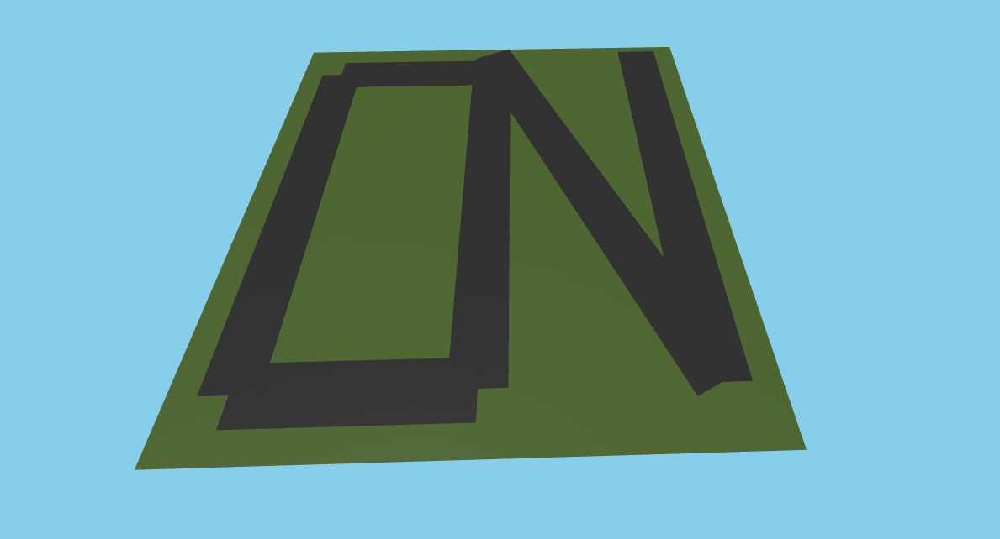

# A-Frame map renderer

The grand idea behind this project is to make a 3D world based on OpenStreetMap data that can be explored in VR (or with a keyboard and mouse).

At the moment, it's a functional but basic demo that supports 1 feature type (roads) and the ability to move through the world with WASD and your mouse.

**[View the demo at a-frame-fun.netlify.app](https://a-frame-fun.netlify.app/)**



## Technologies used

- [A-Frame](https://aframe.io/) is the framework that makes 3D things work

In the future, OpenStreetMap data will be used to populate the scene with map features.

## Development instructions

```bash
yarn # Install dependencies
yarn dev # Start a development server
```
